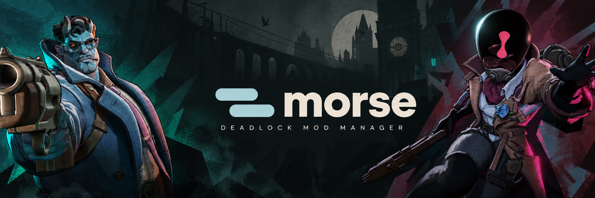
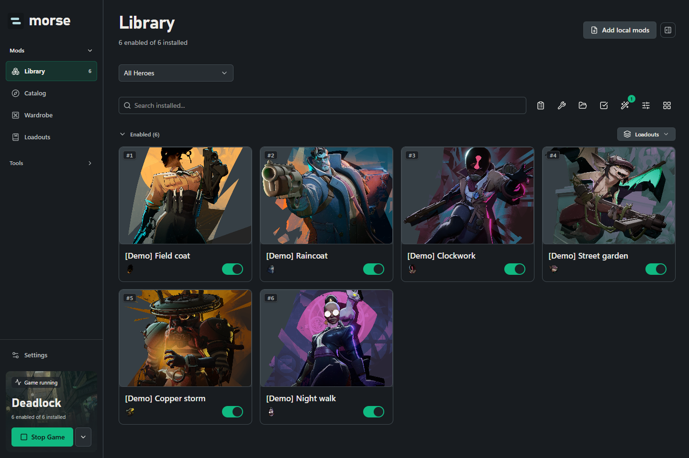
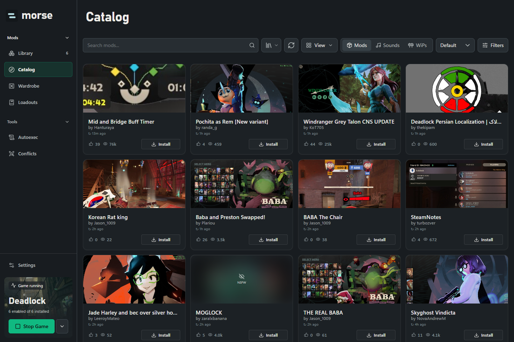
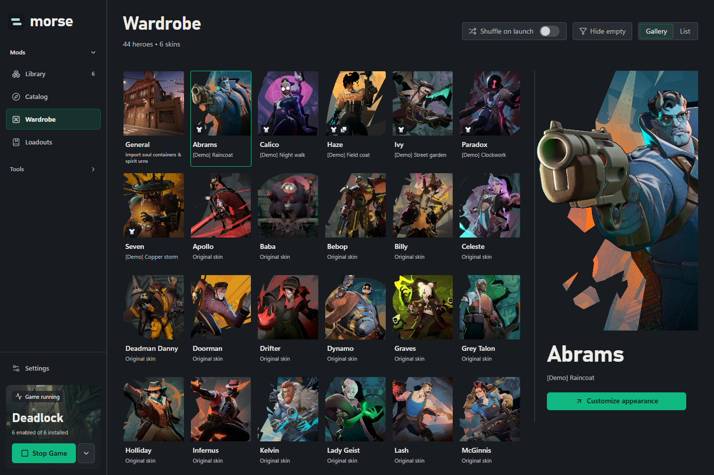
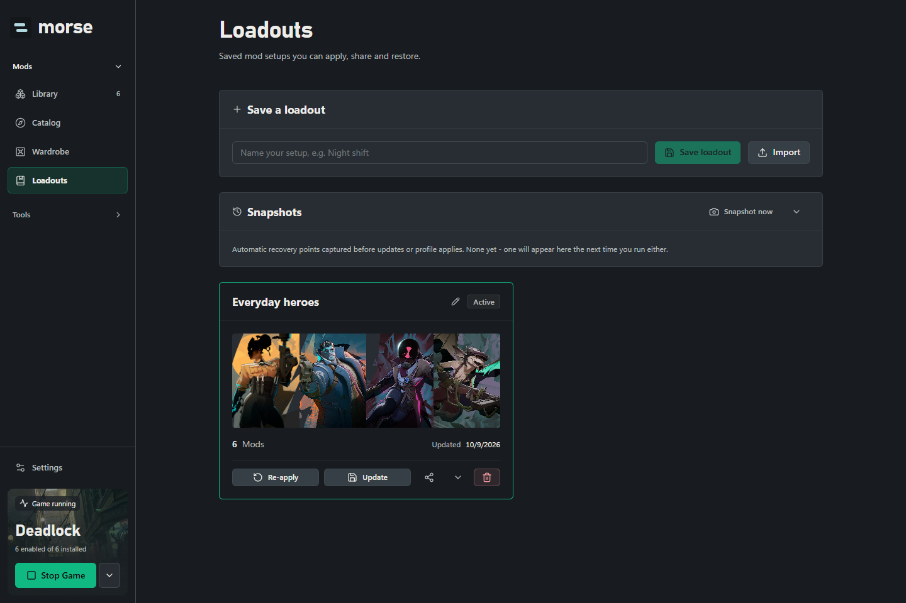
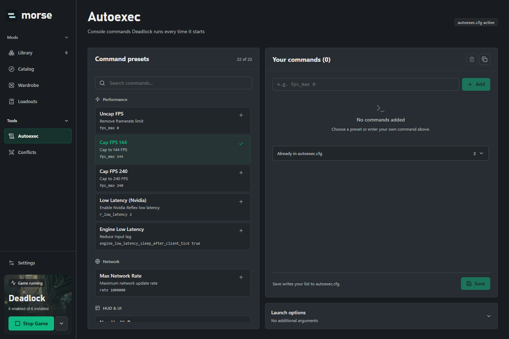
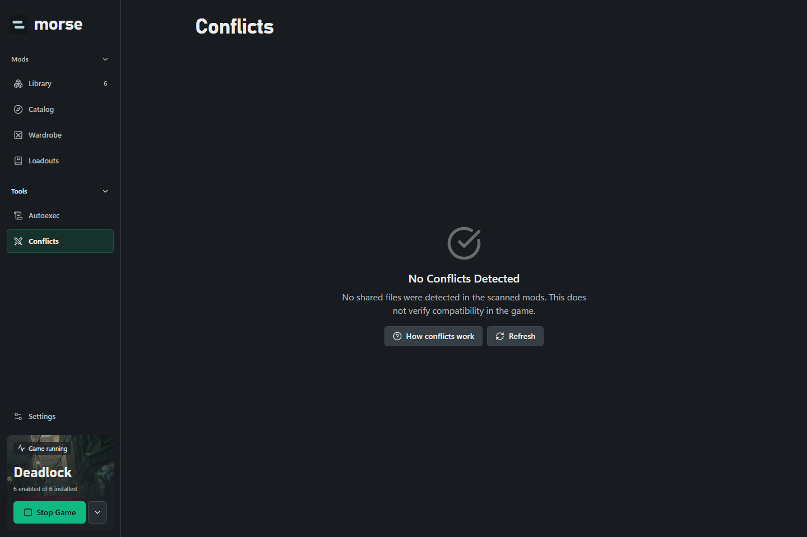
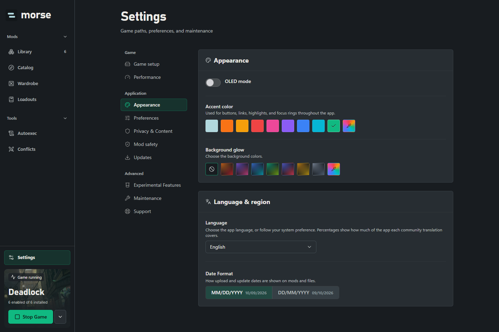

  
  
<strong>Your Deadlock mods, in one place.</strong>

  
Find your next mod. Build a loadout. Make the game yours.

  

    <a href="https://github.com/irina958-design/morse-app/releases/latest"><strong>Download for Windows</strong></a> ·
    <a href="#explore-morse">Explore Morse</a> ·
    <a href="https://github.com/irina958-design/morse-app/issues">Get help</a> ·
    <a href="README.ru.md">Русский</a>
  

  
Windows x64 · English & Русский · Installer & Portable

## Get Morse

| | Download | What to expect |
| --- | --- | --- |
| **Installer** | [Morse Setup](https://github.com/irina958-design/morse-app/releases/download/v0.2.0/Morse-Setup-0.2.0.exe) | Choose an install location, add shortcuts and install supported updates from Morse. |
| **Portable** | [Morse Portable](https://github.com/irina958-design/morse-app/releases/download/v0.2.0/Morse-Portable-0.2.0.exe) | Launch without an installation wizard. Settings are stored in your Windows user profile. Update by downloading the new portable build. |

[Release notes & checksums](https://github.com/irina958-design/morse-app/releases/tag/v0.2.0)

The Windows build is currently unsigned. Windows may show an unknown-publisher or SmartScreen prompt. Only Windows x64 packages are included in this release.

## Explore Morse

Discover. Customize. Play. Select a screenshot to explore the details.

<table>
  <tr>
    <td width="50%" valign="top">
      
      <h3>Library</h3>
      
<strong>Your collection, under control</strong> Enable mods, manage variants and arrange load order.

    </td>
    <td width="50%" valign="top">
      
      <h3>Catalog</h3>
      
<strong>Find your next favorite</strong> Discover mods, explore previews and choose files to install.

    </td>
  </tr>
  <tr>
    <td width="50%" valign="top">
      
      <h3>Wardrobe</h3>
      
<strong>A look for every hero</strong> Explore your roster and its installed cosmetics.

    </td>
    <td width="50%" valign="top">
      
      <h3>Loadouts</h3>
      
<strong>Keep the combinations you love</strong> Save, update and share your mod setups.

    </td>
  </tr>
  <tr>
    <td width="50%" valign="top">
      
      <h3>Autoexec</h3>
      
<strong>Ready before the match</strong> Edit startup commands and launch options in one workspace.

    </td>
    <td width="50%" valign="top">
      
      <h3>Conflicts</h3>
      
<strong>See what overlaps</strong> Inspect shared files before adjusting your setup.

    </td>
  </tr>
</table>

<strong>Settings · Make Morse yours</strong>

English and Russian, accent colors, backgrounds, OLED mode and reduced-motion support.

Actual application screenshots with a demo profile. Demo entries illustrate the interface, not in-game results. Optimization and experimental tabs are not included.

## First steps

1. Download Setup or Portable from the release above.
2. Open Morse and select your Deadlock installation when prompted.
3. Browse Catalog or add your local mods, then manage them in Library.
4. Save a loadout before changing your setup. Close Deadlock before operations that change game files.

## Updates and support

Morse 0.2.0 checks this public repository for releases. Open **Settings → Updates** to check for a newer version. Installer builds support in-app installation; portable builds link to the release download.

Coming from a private 0.1.x build? Install 0.2.0 manually once: those older builds may still point to the private repository.

Found a problem? Use **Settings → Support** to prepare a diagnostic report, review it, and open a [bug report](https://github.com/irina958-design/morse-app/issues/new?template=bug_report.md). Do not post passwords, tokens or personal files. See [Support](SUPPORT.md) for the details that help us reproduce an issue.

## About this repository

This is the official public download and support hub for Morse. It contains product documentation, screenshots, license notices and release packages. Application source code and development history are not published here.

Morse is an independent project built on the MIT-licensed Grimoire core. It is not affiliated with or endorsed by Valve or GameBanana. Deadlock and game artwork belong to their respective owners. See [License](LICENSE) and [Third-party notices](THIRD_PARTY_NOTICES.md).
